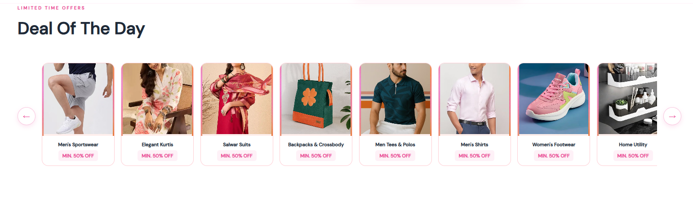
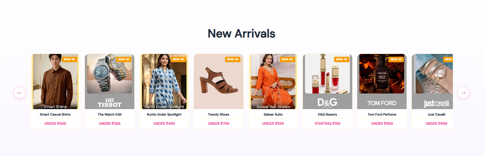
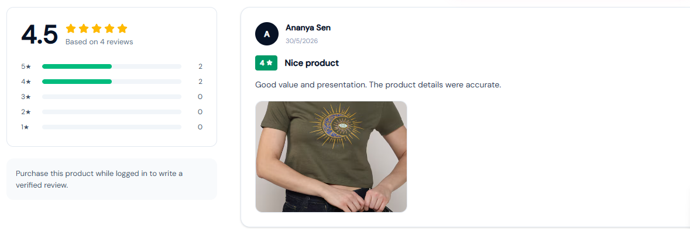
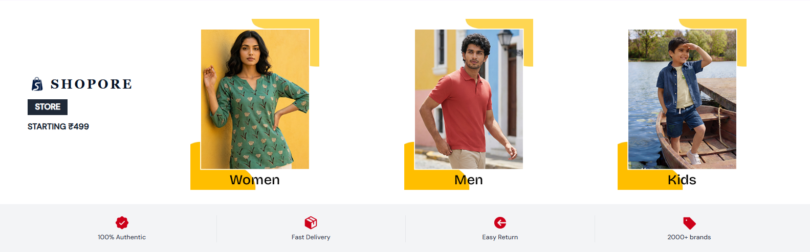
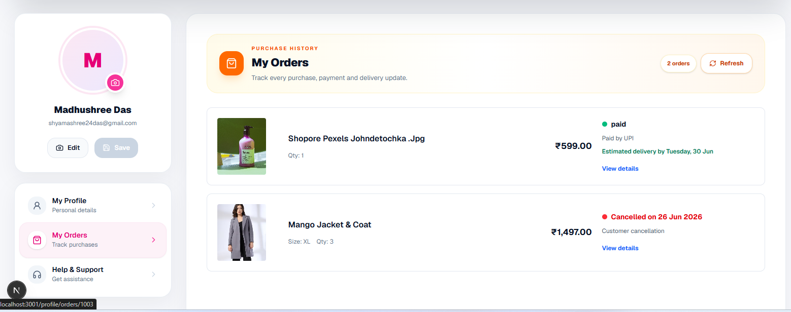
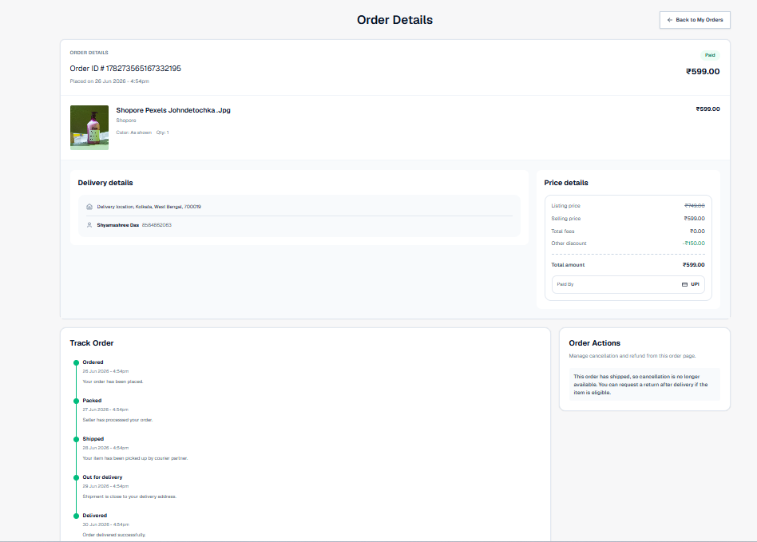
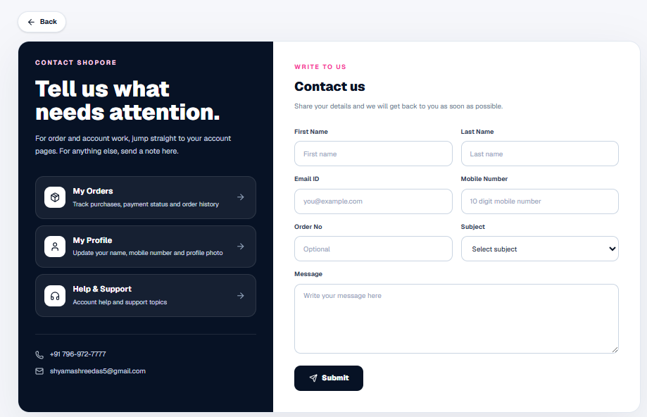
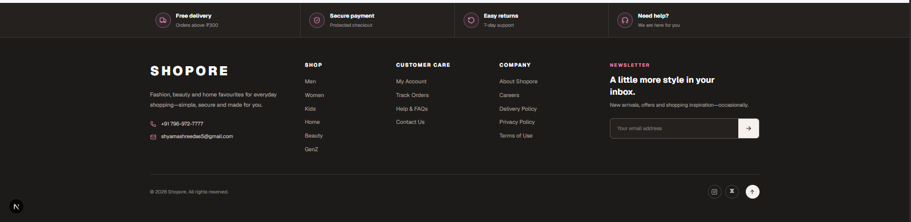

<div align="center">

  

  # SHOPORE

  ### A modern, full-stack shopping experience

  Browse, discover, save and shop across fashion, beauty, home and lifestyle—all through a responsive storefront built for desktop and mobile.

  <br />

  
  
  
  
  

  <br /><br />

  **Responsive storefront · Product discovery · Wishlist · Cart · Secure checkout · Orders · Reviews · Customer support**

</div>

---

## 🎬 Full Project Walkthrough

<p align="center">
  <a href="./public/recshopore.mp4">
    
  </a>
</p>

<p align="center">
  <a href="./public/recshopore.mp4"><b>▶ Watch the complete Shopore demo</b></a>
  <br />
  <sub>Responsive storefront · Product discovery · Cart · Checkout · Account · Orders · Support</sub>
</p>

---

## 📸 Product Preview

<p align="center">
  A visual walkthrough of the complete Shopore customer journey—from discovery to checkout and after-sales support.
</p>

<table>
  <tr>
    <td colspan="2" align="center">
      
      <br />
      <sub><b>01 · Landing Experience</b> — Campaign-led discovery with a clean, premium storefront</sub>
    </td>
  </tr>
  <tr>
    <td width="50%" align="center">
      
      <br />
      <sub><b>02 · Deal of the Day</b></sub>
    </td>
    <td width="50%" align="center">
      
      <br />
      <sub><b>03 · New Arrivals</b></sub>
    </td>
  </tr>
  <tr>
    <td width="50%" align="center">
      
      <br />
      <sub><b>04 · Product Details</b> — Size, price, delivery and bag actions</sub>
    </td>
    <td width="50%" align="center">
      
      <br />
      <sub><b>05 · Ratings &amp; Reviews</b> — Verified customer feedback</sub>
    </td>
  </tr>
  <tr>
    <td colspan="2" align="center">
      
      <br />
      <sub><b>06 · Curated Collections</b> — Responsive product discovery across every department</sub>
    </td>
  </tr>
  <tr>
    <td width="50%" align="center">
      
      <br />
      <sub><b>07 · My Orders</b> — Purchase history and delivery updates</sub>
    </td>
    <td width="50%" align="center">
      
      <br />
      <sub><b>08 · Help &amp; Support</b> — Guided support for every shopping concern</sub>
    </td>
  </tr>
  <tr>
    <td width="50%" align="center">
      
      <br />
      <sub><b>09 · Order Details</b> — Payment, address and tracking information</sub>
    </td>
    <td width="50%" align="center">
      
      <br />
      <sub><b>10 · Contact</b> — A focused route to customer assistance</sub>
    </td>
  </tr>
  <tr>
    <td colspan="2" align="center">
      
      <br />
      <sub><b>11 · Complete Shopping Shell</b> — Navigation, policies, newsletter and support links</sub>
    </td>
  </tr>
</table>

---

## ✨ What makes Shopore different?

| Experience | Highlights |
|---|---|
| **Discover** | Multi-department catalog, campaign sections, search, filters and sorting |
| **Decide** | Product details, size selection, delivery check and verified reviews |
| **Shop** | Persistent cart, wishlist, saved addresses, COD, Razorpay and Google Pay flows |
| **Track** | Account dashboard, order history, delivery status, cancellation and returns |
| **Get help** | Contextual FAQs, support topics, contact form, notifications and shopping assistant |
| **Use anywhere** | Purpose-built responsive layouts for desktop, tablet and mobile |

## 🧱 Architecture

```text
Customer Browser
      │
      ▼
Next.js 16 Storefront  ──────►  ASP.NET Core Web API  ──────►  SQL Server
React 19 + TypeScript           EF Core + Swagger              Shopore_DB
```

## 🚀 Run locally

```bash
# Frontend
npm install
npm run dev
```

```powershell
# Backend
dotnet run --project .\Shoporestore_Backend\Shoporestore.Api\Shoporestore.Api.csproj --urls http://localhost:5285
```

```env
# .env.local
NEXT_PUBLIC_API_URL=http://localhost:5285
NEXT_PUBLIC_RAZORPAY_KEY_ID=your_test_key
```

<div align="center">

  ---

  Built with care for a shopping experience that feels **clear, responsive and complete**.

  **SHOPORE © 2026**

</div>
